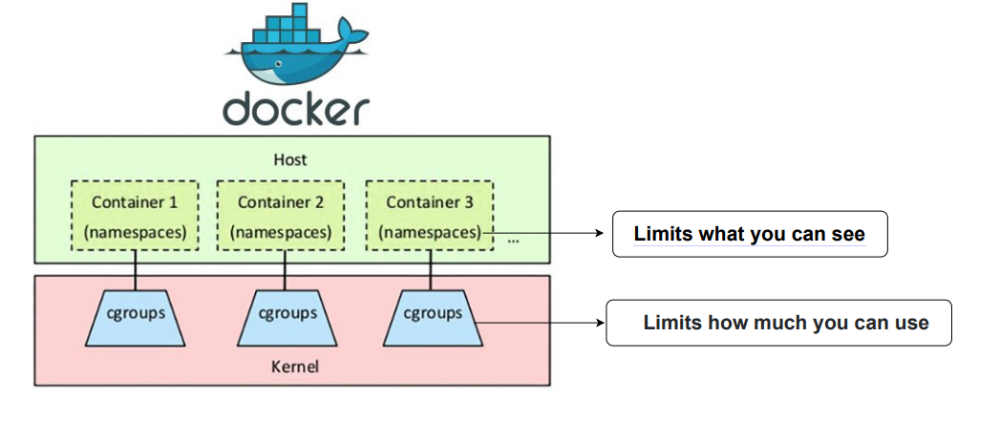

# Containers 101

## Container Concepts

### What are Containers --Terminology-- ?
- IRL:
  - Standardized way for you to package your items together into one shipment
  - Standard
  - Efficiency
  - Portable
  - Separation

- IVL:
  - Standardized way for you to package your apps, config and dependencies together into one logical object.
  - Standard
  - Efficiency
  - Portableq
  - Separation

### What are Applications ?
- To Humans:
  - Programs developed to perform specific tasks on a computer

- To Computers:
  - Binary instructions for a computer to exectue tasks
  - known as a process

### VMs vs Containers

### What are Containers --Technology-- ?
- Linux Kernel Features:
  - Namespaces
    - What a process can see
  - Control Groups (cgroups)
    - What a process can use

- To Computers:
  - A contaner is a process extracted from tar to namespaces and controleld by cgroups

### Ressources:
- https://kube.academy/courses/containers-101/lessons/container-concepts
