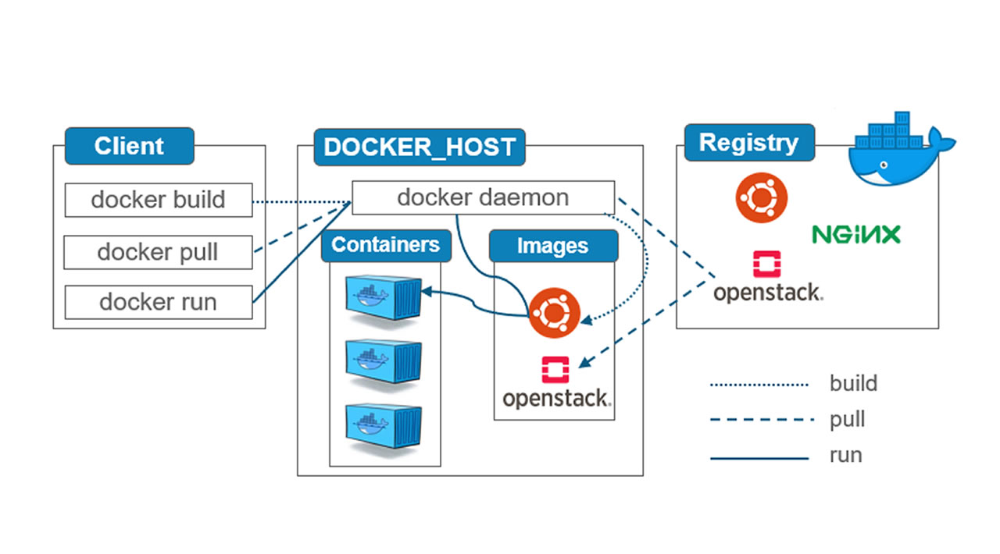

# Containers 101

## Container Concepts

### What are Containers --Terminology-- ?
- IRL:
  - Standardized way for you to package your items together into one shipment
  - Standard
  - Efficiency
  - Portable
  - Separation

- IVL:
  - Standardized way for you to package your apps, config and dependencies together into one logical object.
  - Standard
  - Efficiency
  - Portable
  - Separation

### What are Applications ?
- To Humans:
  - Programs developed to perform specific tasks on a computer

- To Computers:
  - Binary instructions for a computer to exectue tasks
  - known as a process

### VMs vs Containers


### What are Containers --Technology-- ?
- Linux Kernel Features:
  - Namespaces
    - What a process can see
  - Control Groups (cgroups)
    - What a process can use

- To Computers:
  - A contaner is a process extracted from tar to namespaces and controleld by cgroups


### Container Client || Container Runtime || Container Registry


## Anatomy of a Container

### Inspect Image
- sudo docker pull alpine
- sudo docker image inspect alpine:latest
- sudo docker history alpine:latest 
- sudo docker run -d --hostname aaa --name test alpine:latest sleep 100000
- ps aux | grep sleep 
- sudo docker inspect test | grep -i pid

### Namespaces
- Run program with namespaces of container
  - sudo nsenter --target 6136 --uts

### CGroups
- Check cgroups of a container
  - cat /proc/6136/cgroup

## Pull, Build, and Run a Container Image

### Pull Container Image
  - sudo docker pull alpine:3.10

### Building Container Image
- Build from Dockerfile
  - docker build -t image-name path

- If Dockerfile isn't named `Dockerfile` use -f
  - docker build -t image-name -f dockerfiletest .

- Difference between ENTRYPOINT and CMD
  - `CMD` and `ENTRYPOINT` => directives to specify -> cmd run by default in built images
  - If use `CMD` -> Docker will run command using the default `ENTRYPOINT` -> /bin/sh
  - CMD is an arg for ENTRYPOINT
  - `ENTRYPOINT` run `CMD` -> `/bin/sh /bin/date`
    ex:
    ```
    sudo docker build -t 02 .
    sudo docker run 02
    ```

-  Override `CMD`
```
sudo docker run 02 /bin/hostname
95eb48c83dee
```

### Run Container Image
sudo docker run -it nginx sh


### Ressources:
- https://kube.academy/courses/containers-101/lessons/container-concepts
